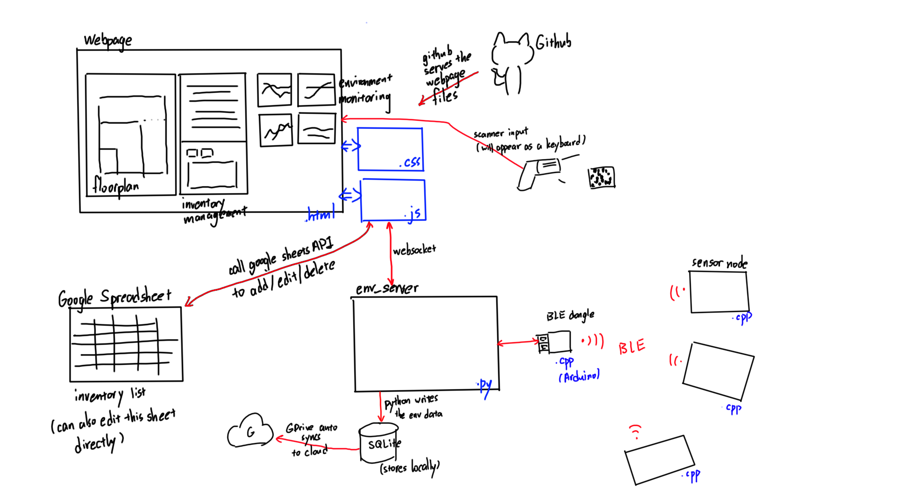

# Lab-Digital-Twin

Inventory management and environment monitoring system for a STEM lab.

## System Overview

## System Block Diagram

### Environment Monitoring

While conducting physical experiments in a lab, there are multiple variables from the lab environment that can affect the data collected in the experiment, for example, temperature, humidity, mechanical vibration, magnetic field etc. It would be beneficial, therefore, to establish a system that can monitor and record the common environmental data from the lab and thus offer the possiblilty that, in the case of experiment data mismatch, researchers can go into the database and see the possible environmental factors that affects the experiment.

Striving to solve these issues, we design and build a realtime environment monitoring system that can sample the environmental data in realtime and record in a database system for future reference.

The system consist of several Adafruit nRF52840 microcontrollers, which communicate with a nRF52840 USB dongle with BLE. The sensor nodes will read environmental data from the onboard I2C sensors, and transmit the data to the USB dongle, which in turn transmit to the host PC, every 15 seconds.

The PCB hardware design can be accessed [here](https://oshwhub.com/t-k-233/urap-sensor-node-v1). 

More detailed description can be found [here](https://github.com/Ma-Lab-Cal/Lab-Digital-Twin/blob/main/firmware/README.md)

### Inventory Management

#### Background

Equipment management for labs or workshops has always been a difficult problem. We wish to build a system to help.

We want to tackle the following issues:

- knowing if an item exist in the lab, or need to be bought

- locating the target item

- knowing if anyone is currently using the item, and if there's any spare ones to use

Thus, we design the system as a checkout system. By default, all of the items purchased will be logged into the system and be assigned a specific location to store it, be it a drawer, a tote, a box, or some other physical containers. All of the default location of all the items will be considered the "Public Storage" location of that item, and can be displayed on the system webpage when searching, so that the user will know where to find it. Additionally, we will put 2D barcodes on most of the items for the system to keep track of. 

#### Categories

We divide the parts into three categories, I, II, and III.

Category III are the most inexpensive and most common parts. Examples of items in this category would be screws, USB Type A micro to USB Type A cables, or letter-sized printing papers. Due to the large quantity, it is not useful nor easy to keep track of the number of items in this category. And thus, we do not need users to check in / out when using these parts.

Category II are the more expensive and rare parts. Majority of the item belongs to this category. 

Category I are the most unique parts. There could be only 1 or 2 of that item in the entire lab, and thus need to be treated with care. And also they are often very expensive.

#### User Operation

When taking parts from the public storage, users will need to log in the system (probably by scanning the barcode on their student ID), search for the desired parts, and go to the physical public storage location to take the parts. When taking, the user will need to scan the part ID to indicate they are taking away the parts, and scan more, if taking multiple ones. The system then can automatically track the change, and assign that number of parts under this user, indicating that he/she is using this.

#### Barcodes

We decide to use 2D barcode, instead of 1D barcode, because they are more compact, and easier to scan. Among the different 2D barcode encodings, the DataMatrix will have the smallest size when the content size is short. 

## Usage

1. Clone the entire repository to local drive.

2. Run the .bat scripts in the `scripts` folder.

## Repo Structure

`/database` stores the environmental data.

`/docs` stores the frontend webpage, which will be served by Github Page server.

`/firmware` stores the Arduino codes.

`/firmware/Raytac_PC_dongle_firmware` stores the Arduino code running on the BLE USB Dongle.

`/firmware/sensor_node_firmware` stores the Arduino code running on the sensor nodes. Need to change device ID when flashing to different nodes.

`/frontend` stores the previous webpage code, that is not used by current revision.

`/hardware` stores hardware-related files.

`/script` stores the entry script. When running the program, user only need to run scripts here.

`/server` stores the backend Python server program, as well as some other funtional test codes.

## TODOs

- [ ] Switch BLE nodes to WiFi nodes to improve stability and solve the dongle disconnect issue.

